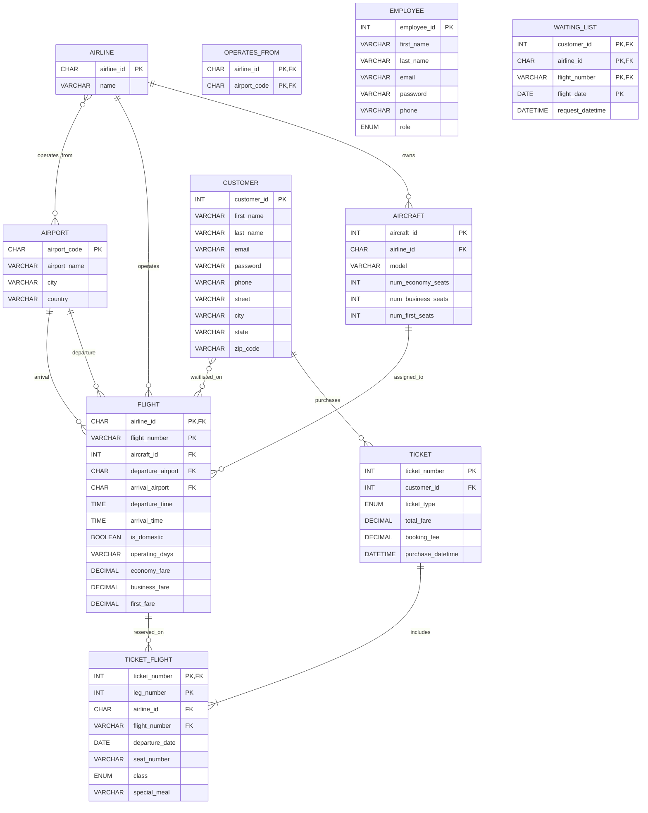

# ER Diagram - Online Travel Reservation System

```mermaid
erDiagram
    AIRLINE ||--o{ AIRCRAFT : owns
    AIRLINE ||--o{ FLIGHT : operates
    AIRLINE }o--o{ AIRPORT : operates_from
    AIRCRAFT ||--o{ FLIGHT : assigned_to
    AIRPORT ||--o{ FLIGHT : departure
    AIRPORT ||--o{ FLIGHT : arrival
    CUSTOMER ||--o{ TICKET : purchases
    TICKET ||--|{ TICKET_FLIGHT : includes
    FLIGHT ||--o{ TICKET_FLIGHT : reserved_on
    CUSTOMER }o--o{ FLIGHT : waitlisted_on

    AIRLINE {
        CHAR airline_id PK
        VARCHAR name
    }

    AIRPORT {
        CHAR airport_code PK
        VARCHAR airport_name
        VARCHAR city
        VARCHAR country
    }

    OPERATES_FROM {
        CHAR airline_id PK, FK
        CHAR airport_code PK, FK
    }

    AIRCRAFT {
        INT aircraft_id PK
        CHAR airline_id FK
        VARCHAR model
        INT num_economy_seats
        INT num_business_seats
        INT num_first_seats
    }

    FLIGHT {
        CHAR airline_id PK, FK
        VARCHAR flight_number PK
        INT aircraft_id FK
        CHAR departure_airport FK
        CHAR arrival_airport FK
        TIME departure_time
        TIME arrival_time
        BOOLEAN is_domestic
        VARCHAR operating_days
        DECIMAL economy_fare
        DECIMAL business_fare
        DECIMAL first_fare
    }

    CUSTOMER {
        INT customer_id PK
        VARCHAR first_name
        VARCHAR last_name
        VARCHAR email
        VARCHAR password
        VARCHAR phone
        VARCHAR street
        VARCHAR city
        VARCHAR state
        VARCHAR zip_code
    }

    EMPLOYEE {
        INT employee_id PK
        VARCHAR first_name
        VARCHAR last_name
        VARCHAR email
        VARCHAR password
        VARCHAR phone
        ENUM role
    }

    TICKET {
        INT ticket_number PK
        INT customer_id FK
        ENUM ticket_type
        DECIMAL total_fare
        DECIMAL booking_fee
        DATETIME purchase_datetime
    }

    TICKET_FLIGHT {
        INT ticket_number PK, FK
        INT leg_number PK
        CHAR airline_id FK
        VARCHAR flight_number FK
        DATE departure_date
        VARCHAR seat_number
        ENUM class
        VARCHAR special_meal
    }

    WAITING_LIST {
        INT customer_id PK, FK
        CHAR airline_id PK, FK
        VARCHAR flight_number PK, FK
        DATE flight_date PK
        DATETIME request_datetime
    }
```
