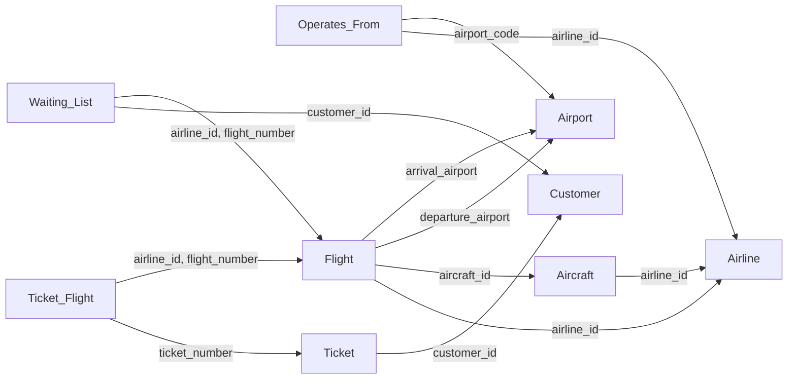

# ER Diagram and Relational Schema -- Online Travel Reservation System

## Identified Entities and Key Attributes

From the project spec, the data falls into these entity categories: **Airlines, Aircrafts, Airports, Flights, Tickets, Customers, and Employees**. Below is the full design.

---

## Entity-Relationship Diagram

```mermaid
erDiagram
    AIRLINE ||--o{ AIRCRAFT : "owns"
    AIRLINE ||--o{ FLIGHT : "operates"
    AIRLINE }o--o{ AIRPORT : "operates_from"
    AIRCRAFT ||--o{ FLIGHT : "assigned_to"
    AIRPORT ||--o{ FLIGHT : "departs_from"
    AIRPORT ||--o{ FLIGHT : "arrives_at"
    CUSTOMER ||--o{ TICKET : "purchases"
    TICKET ||--|{ TICKET_FLIGHT : "includes"
    FLIGHT ||--o{ TICKET_FLIGHT : "part_of"
    CUSTOMER }o--o{ FLIGHT : "waitlisted_on"

    AIRLINE {
        CHAR2 airline_id PK
        VARCHAR name
    }

    AIRCRAFT {
        INT aircraft_id PK
        CHAR2 airline_id FK
        VARCHAR model
        INT num_economy_seats
        INT num_business_seats
        INT num_first_seats
    }

    AIRPORT {
        CHAR3 airport_code PK
        VARCHAR airport_name
        VARCHAR city
        VARCHAR country
    }

    FLIGHT {
        CHAR2 airline_id PK_FK
        VARCHAR flight_number PK
        INT aircraft_id FK
        CHAR3 departure_airport FK
        CHAR3 arrival_airport FK
        TIME departure_time
        TIME arrival_time
        BOOLEAN is_domestic
        VARCHAR operating_days
    }

    CUSTOMER {
        INT customer_id PK
        VARCHAR first_name
        VARCHAR last_name
        VARCHAR email
        VARCHAR password
        VARCHAR phone
        VARCHAR street
        VARCHAR city
        VARCHAR state
        VARCHAR zip_code
    }

    EMPLOYEE {
        INT employee_id PK
        VARCHAR first_name
        VARCHAR last_name
        VARCHAR email
        VARCHAR password
        VARCHAR phone
        ENUM role
    }

    TICKET {
        INT ticket_number PK
        INT customer_id FK
        ENUM ticket_type
        DECIMAL total_fare
        DECIMAL booking_fee
        DATETIME purchase_datetime
    }

    TICKET_FLIGHT {
        INT ticket_number PK_FK
        INT leg_number PK
        CHAR2 airline_id FK
        VARCHAR flight_number FK
        DATE departure_date
        VARCHAR seat_number
        ENUM class
        VARCHAR special_meal
    }

    WAITING_LIST {
        INT customer_id PK_FK
        CHAR2 airline_id PK_FK
        VARCHAR flight_number PK_FK
        DATE flight_date PK
        DATETIME request_datetime
    }
```


---

## Design Decisions and Merge Rules Applied

- **Customer / Account (1:1 -- MERGED):** The spec says each customer has exactly one account with a reservation portfolio. Since this is 1:1, we merge Account into Customer. The "reservation portfolio" is implicitly the collection of Tickets belonging to that customer.
- **Airline / Flight (1:N):** A flight is operated by exactly one airline. The flight_number is unique only within an airline, so the Flight PK is the composite **(airline_id, flight_number)**.
- **Airline / Aircraft (1:N):** An airline owns multiple aircraft. FK `airline_id` in Aircraft references Airline.
- **Airline / Airport (M:N):** An airline operates from multiple airports, and an airport serves multiple airlines. This produces the **Operates_From** junction table.
- **Ticket / Flight (M:N with attributes):** A ticket is associated with a *sequence* of flights (legs). This M:N relationship has attributes (seat, class, meal, date), producing the **Ticket_Flight** junction table with `leg_number` for ordering.
- **Customer / Flight waiting list (M:N):** A customer can be waitlisted on multiple flights, and a flight can have multiple waitlisted customers. This produces the **Waiting_List** junction table.
- **Employee role:** Admin and Customer Representative are distinguished by a `role` column rather than separate tables, since they share the same attributes (merge via generalization).

---

## Relational Schema

Below is the schema with primary keys **bolded** and foreign keys marked with (FK).

### 1. Airline


| Column         | Type         | Constraint  |
| -------------- | ------------ | ----------- |
| **airline_id** | CHAR(2)      | PRIMARY KEY |
| name           | VARCHAR(100) | NOT NULL    |


### 2. Airport


| Column           | Type         | Constraint  |
| ---------------- | ------------ | ----------- |
| **airport_code** | CHAR(3)      | PRIMARY KEY |
| airport_name     | VARCHAR(100) | NOT NULL    |
| city             | VARCHAR(100) | NOT NULL    |
| country          | VARCHAR(100) | NOT NULL    |


### 3. Operates_From (Airline M:N Airport)


| Column           | Type    | Constraint        |
| ---------------- | ------- | ----------------- |
| **airline_id**   | CHAR(2) | PK, FK -> Airline |
| **airport_code** | CHAR(3) | PK, FK -> Airport |


### 4. Aircraft


| Column             | Type        | Constraint                  |
| ------------------ | ----------- | --------------------------- |
| **aircraft_id**    | INT         | PRIMARY KEY, AUTO_INCREMENT |
| airline_id         | CHAR(2)     | FK -> Airline, NOT NULL     |
| model              | VARCHAR(50) | NOT NULL                    |
| num_economy_seats  | INT         | NOT NULL                    |
| num_business_seats | INT         | NOT NULL                    |
| num_first_seats    | INT         | NOT NULL                    |


### 5. Flight


| Column            | Type        | Constraint               |
| ----------------- | ----------- | ------------------------ |
| **airline_id**    | CHAR(2)     | PK, FK -> Airline        |
| **flight_number** | VARCHAR(10) | PK                       |
| aircraft_id       | INT         | FK -> Aircraft, NOT NULL |
| departure_airport | CHAR(3)     | FK -> Airport, NOT NULL  |
| arrival_airport   | CHAR(3)     | FK -> Airport, NOT NULL  |
| departure_time    | TIME        | NOT NULL                 |
| arrival_time      | TIME        | NOT NULL                 |
| is_domestic       | BOOLEAN     | NOT NULL                 |
| operating_days    | VARCHAR(20) | NOT NULL                 |


- `departure_airport != arrival_airport` (CHECK constraint)
- `operating_days` stores day abbreviations, e.g. `"Mon,Wed,Fri"`

### 6. Customer


| Column          | Type         | Constraint                  |
| --------------- | ------------ | --------------------------- |
| **customer_id** | INT          | PRIMARY KEY, AUTO_INCREMENT |
| first_name      | VARCHAR(50)  | NOT NULL                    |
| last_name       | VARCHAR(50)  | NOT NULL                    |
| email           | VARCHAR(100) | UNIQUE, NOT NULL            |
| password        | VARCHAR(255) | NOT NULL                    |
| phone           | VARCHAR(20)  |                             |
| street          | VARCHAR(100) |                             |
| city            | VARCHAR(50)  |                             |
| state           | VARCHAR(50)  |                             |
| zip_code        | VARCHAR(10)  |                             |


### 7. Employee


| Column          | Type                          | Constraint                  |
| --------------- | ----------------------------- | --------------------------- |
| **employee_id** | INT                           | PRIMARY KEY, AUTO_INCREMENT |
| first_name      | VARCHAR(50)                   | NOT NULL                    |
| last_name       | VARCHAR(50)                   | NOT NULL                    |
| email           | VARCHAR(100)                  | UNIQUE, NOT NULL            |
| password        | VARCHAR(255)                  | NOT NULL                    |
| phone           | VARCHAR(20)                   |                             |
| role            | ENUM('admin', 'customer_rep') | NOT NULL                    |


### 8. Ticket


| Column            | Type                          | Constraint                          |
| ----------------- | ----------------------------- | ----------------------------------- |
| **ticket_number** | INT                           | PRIMARY KEY, AUTO_INCREMENT         |
| customer_id       | INT                           | FK -> Customer, NOT NULL            |
| ticket_type       | ENUM('one-way', 'round-trip') | NOT NULL                            |
| total_fare        | DECIMAL(10,2)                 | NOT NULL                            |
| booking_fee       | DECIMAL(10,2)                 | NOT NULL                            |
| purchase_datetime | DATETIME                      | NOT NULL, DEFAULT CURRENT_TIMESTAMP |


### 9. Ticket_Flight (Ticket M:N Flight junction -- with attributes)


| Column            | Type                                 | Constraint                                  |
| ----------------- | ------------------------------------ | ------------------------------------------- |
| **ticket_number** | INT                                  | PK, FK -> Ticket                            |
| **leg_number**    | INT                                  | PK (sequence: 1, 2, 3...)                   |
| airline_id        | CHAR(2)                              | FK (with flight_number) -> Flight, NOT NULL |
| flight_number     | VARCHAR(10)                          | FK (with airline_id) -> Flight, NOT NULL    |
| departure_date    | DATE                                 | NOT NULL                                    |
| seat_number       | VARCHAR(10)                          |                                             |
| class             | ENUM('economy', 'business', 'first') | NOT NULL                                    |
| special_meal      | VARCHAR(50)                          |                                             |


### 10. Waiting_List (Customer M:N Flight junction)


| Column            | Type        | Constraint                            |
| ----------------- | ----------- | ------------------------------------- |
| **customer_id**   | INT         | PK, FK -> Customer                    |
| **airline_id**    | CHAR(2)     | PK, FK (with flight_number) -> Flight |
| **flight_number** | VARCHAR(10) | PK, FK (with airline_id) -> Flight    |
| **flight_date**   | DATE        | PK                                    |
| request_datetime  | DATETIME    | NOT NULL, DEFAULT CURRENT_TIMESTAMP   |


---

## Foreign Key Summary




---

## Deliverable

A single SQL file (`schema.sql`) containing all `CREATE TABLE` statements with proper PRIMARY KEY, FOREIGN KEY, NOT NULL, UNIQUE, CHECK, and ENUM constraints, plus any useful indexes.